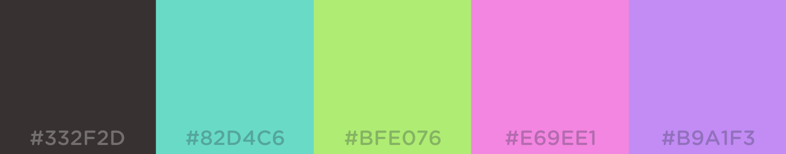
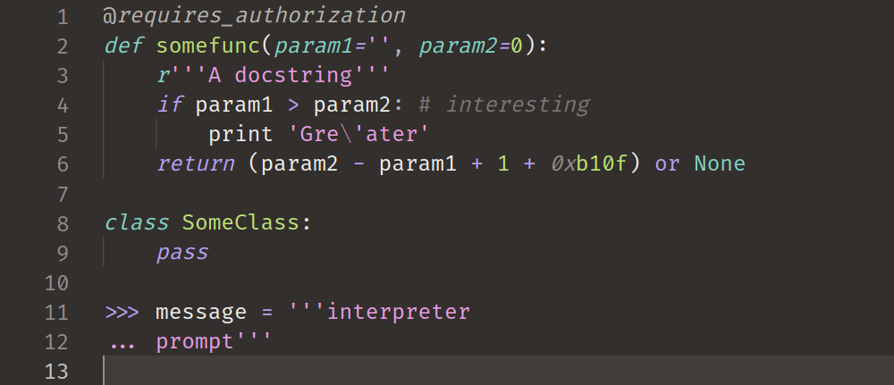
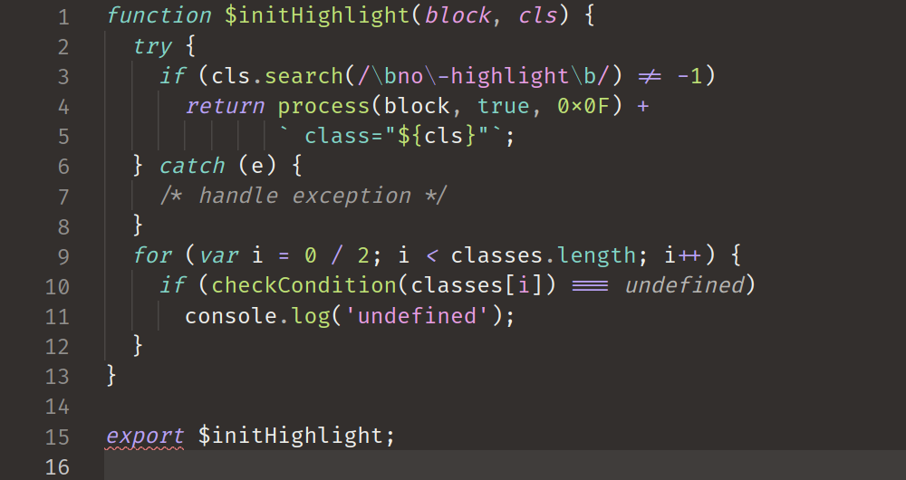

# Flunky

### Palette

- `#332F2D`/`#ECEDEA`
- `#82D4C6`
- `#BFE076`
- `#E69EE1`
- `#B9A1F3`

## Previews

- [Python](#python)
- [Javascript](#javascript)
- [Ruby](#ruby)

### Python

### Javascript

### Ruby

---

> _Sample code stolen from https://highlightjs.org/_

> _Palette screenshot stolen from https://coolors.co_